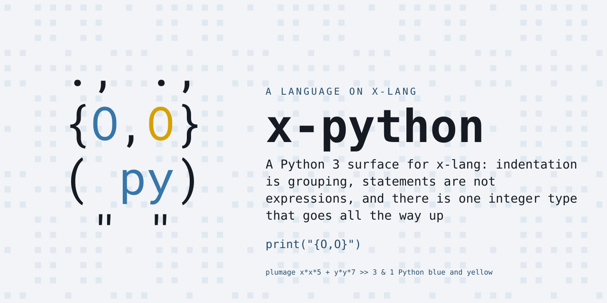
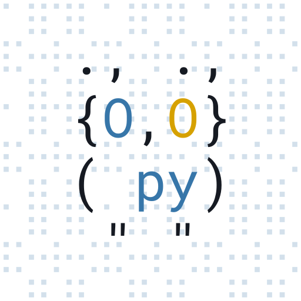

# x-python — Python on x-lang

<p align="center"></p>

A Python 3 surface for [x-lang](https://github.com/jonruttan/x-lang):
indentation is grouping, statements are not expressions, and there is one
integer type that goes all the way up.

```python
$ x -l python
>>> def fact(n):
...     return 1 if n <= 1 else n * fact(n - 1)
>>> print(fact(20))
2432902008176640000
```

x-python is a **lang**: a different surface language loaded over an x-lang
dialect. Where x-lang and Python spell something the same way, Python is free
to mean something different by it — `#` opens a comment here, and `'` opens a
string. The terms are in x-lang's
[lang contract](https://github.com/jonruttan/x-lang/blob/main/docs/lang-contract.md).

## Status

**Early, and the two numbers disagree on purpose.**

The bundle's own suite is green: **351 tests, 0 failed** across 21 spec files
covering the tokenizer, INDENT/DEDENT, expressions, statements, scope, lists,
dicts, tuples, strings, methods, iteration, classes and exceptions.

The conformance suite is not, and it is the one that counts:

```
$ make score
GROUP                        PASS     OF   RATE
basics/builtin                  0     58     0.0%
basics/string                   0     49     0.0%
basics/class                    0     36     0.0%
basics/int                      0     34     0.0%
basics/bytes                    0     28     0.0%
basics/fun                      3     25    12.0%
basics/set                      0     21     0.0%
basics/dict                     0     19     0.0%
basics/try                      5     23    21.7%
basics/list                     1     18     5.6%
...
TOTAL                          21    657     3.2%
```

657 whole Python programs, each compared on its whole stdout against a real
CPython 3.14 run, ranked by how much of it is red.

**3.2% is the honest headline, not 100%.** A hand-written suite measures what
its author thought to ask; `basics/class` is 0 of 36 while `18-classes.spec.md`
is green, because the conformance programs reach for `__init__` arguments,
inheritance, `repr` and attribute errors in combinations nobody sat down and
enumerated. The scoreboard was built before the language for exactly this
reason: it turns "what should a Python implementation do next" from a taste
question into a sorted list, and it does not let a green local suite feel like
progress it is not.

## The suite, and why it is this one

**Python has no test262.** There is no vendor-neutral conformance suite. The
de-facto standard is CPython's `Lib/test`, and it is unusable to a young
implementation: unittest-based, so `unittest`, `io` and a slab of stdlib must
work before the first assertion runs; dense with `@cpython_only` and
`impl_detail`; and PSF-licensed rather than MIT.
(`MalloyPower/python-compliance` surfaces in searches and is a research corpus
for an ESEM 2017 paper, with no tests in it.)

**MicroPython's `tests/` was written by people implementing a subset**, which
is this bundle's position exactly. Measured against v1.29.0 rather than
assumed:

| suite | `.py` files | run under CPython 3.14 unmodified |
|---|---:|---:|
| `basics/` | 576 | 562 |
| `float/` | 69 | 69 |
| `import/` | 30 | 30 |
| `unicode/` | 25 | 21 |
| | | **682** |

The files are tiny, import nothing, and assert by printing — one program, one
stdout blob, which is the same shape a `.spec.md` case is. Only 65 of the 576
in `basics/` carry a `.exp` file; the rest are *differential*, meaning upstream
generates the expectation by running CPython. So does this bundle.

**CPython is the oracle, not MicroPython.** Where CPython refuses a file — 15
of them, `builtin_help`, `memoryerror`, the `*_micropython` ones — upstream's
`.exp` records MicroPython's own deviation, and x-python has no business chasing
that. Those are excluded and counted, never silently adopted. Upstream's
`cpydiff/` is the same idea from the other side: 82 documented, sanctioned
places a subset is allowed to differ.

682 programs have an oracle; 657 became spec cases. The 43 that did not are
listed by name and reason in `tests/conformance/SKIPPED.md`, because a score's
denominator is only honest if the exclusions are auditable.

## Install

**No releases are cut yet**, so there is no pin to fetch and
`x --install-lang` has nothing to point at. From a clone:

```bash
make install                      # into the x on your PATH
PREFIX=$HOME/.local make install  # or a particular prefix
```

`make uninstall` removes it again. An installed x searches
`<share>/langs/*/lang.xon`, so a lang is installed when its files are there —
no registry, no database.

**One trap, and it is the one you will hit.** `x` decides where to look for
langs from the directory you run it *in*. Inside an **x-lang checkout** it
searches `deps/langs/` and an installed lang is invisible, however correctly it
was installed:

```
$ cd path/to/x-lang && x -l python
Error: no library, app or lang named 'python'
  searched lib/python.x, apps/python/run.x
      and deps/langs/*/lang.xon
```

Run it from anywhere else, or name the bundles explicitly — `X_LANG_DIR` wins
in both modes:

```bash
X_LANG_DIR=$HOME/.local/share/x/langs/ x -l python   # the installed one
X_LANG_DIR=/path/to/x-python/.. x -l python          # a checkout, uninstalled
```
 Once a `v*` tag is pushed, the release workflow
publishes the tarball, its `.sha256` and a `lang.pin.xon`, and the usual
`x --install-lang …/releases/latest/download/lang.pin.xon` starts working.

## Running it

```bash
x -l python                  # interactive
x -l python -f program.py    # batch
```

x-lang boots the dialect `lang.xon` declares, arms this bundle's module root,
and loads `run.x` on top — which is why nothing here needs to know a path.

**Xenon boots slower than the light dialects**, and that is a deliberate cost:
eight runtime `cc` compilations for the numeric analysers, bought so that
`2 ** 200` is right. See [Why xenon](#why-xenon).

## Development

```bash
X=/path/to/x-lang/x.sh make test   # the bundle's own suite -- 21 spec files
make gen                           # fetch the pinned corpus, generate tests/conformance/
make score                         # pass/total per group, worst first
make conformance                   # the same run, case by case
make clean                         # drop deps/ and tests/conformance/
```

**Pass `X` explicitly.** Without it the suite takes the `x` on your PATH, and an
installed x that trails the checkout reports failures the platform has already
fixed.

**Do not `make install` into an x-lang checkout.** The Makefile asks
`$(X) --share-dir` where to put the bundle, and a checkout answers with its own
root — so the files land in `<checkout>/langs/NAME`, which is not one of the
three paths `-l` searches there. It reports success and the lang stays
invisible. Install into a real `<share>` tree, or use `X_LANG_DIR`.


**The conformance run is serial, and it must stay that way.** It is 112 spec
files each booting a full xenon tower; the platform runner defaults
`PARALLEL_JOBS` to the CPU count, and the per-process allocation ceiling bounds
*one* interpreter, not twelve. `score.sh` forces `PARALLEL=1` for that reason.

**Give it a quiet machine, and distrust a score taken without one.** Serial is
not enough on its own: with other x-lang suites running alongside it, this
scoreboard has reported 1/657 where a quiet run reports 21/657, and the
individual files still score their real numbers when run alone. It does not
crash or warn — it just reports a lower score, which is the worst possible
failure mode for a number whose whole job is to rank what to do next. If a run
disagrees with the last one, re-run a single group with
`sh tests/spec-runner.sh tests/conformance/GROUP.spec.md` before believing it.

`make gen` takes about a minute: it runs CPython twice over every program in
the corpus — once at `PYTHONHASHSEED=0` and once at `1`, so anything whose
output is not reproducible is caught and excluded rather than becoming a test
nothing could ever pass.

Nothing generated is committed. `deps/` is the fetched corpus, verified against
the digest in `tools/conformance/upstream.pin.xon`; `tests/conformance/` is
derived from it and from whichever CPython was the oracle. `make clean` drops
both.

## Design notes

- [Python values want x's type system, not tagged pairs](docs/values-on-the-type-system.md)
  — why containers are tagged pairs today, the constraint that decides how they
  stop being (`make-instance` resolves the type in the *calling* base), and the
  shape that follows. Designed and proved, not built.

## Layout

```
docs/                        design notes
lang.xon                     name, dialect, release pairing
run.x                        THE entry -- and it knows no paths at all
python/base.x                the load order, and python-run
python/tokens.x              the tokenizer, on its own base
python/indent.x              INDENT/DEDENT, driving x/reader/indent
python/parse.x               the parser
python/types.x               Python's values, as x types
python/runtime.x             what the parser emits calls to
tests/spec-runner.sh         sources the platform's shared runner
tests/gen-harness.sh         writes tests/lib/harness.gen.x (generated)
tests/specs/                 the bundle's own suite -- the pipeline
tools/conformance/
  upstream.pin.xon           the corpus: commit, digest, licence, suites
  fetch.sh                   fetch, verify, unpack into deps/
  gen-specs.py               corpus -> .spec.md, with CPython as oracle
  score.sh                   the ranked table
```

## Why xenon

Derived from Python's data model, not from convenience:

- Python 3 has **one** integer type and it is arbitrary-precision. `2 ** 200`
  is not an error and not a float. That is `x/num/bigint.x`.
- `1 / 2` is `0.5`. True division always produces a float, so float is
  reachable from the first arithmetic expression anyone types.
- `dict` is syntax, and `x/type/dict.x` loads by default in the tower dialects
  and in neither light one.

The cost is real: xenon's boot runs eight runtime `cc` compilations for the
numeric analysers, so `x -l python` starts slower than `x -l krn`. Declaring `he`
would buy that back by making `2 ** 200` wrong, which is not a trade.

Not radon. ash needs `rn` for fork/exec/dup2; a Python whose library is `print`
and `len` reaches nothing raw. When `os` and `socket` arrive that gets
revisited — as a decision, which is why it is written down in `lang.xon`.

## The reader, which is done

Both halves of it, and they are why anything scores at all:

- **a tokenizer on its own base** — `(Base make-tok)` / `(Base make-type)`, the
  way `ash/prims.x` does it, so Python's `#` is a comment and its `'` opens a
  string without competing with the sexp reader's types by score.
  `python/tokens.x`.
- **INDENT/DEDENT** — x-lang#520 is closed and `lib/x/reader/indent.x` holds the
  stack discipline that Logo and x-sweet each used to own a copy of. x-python
  does not write a third one: `python/indent.x` constructs an `Indent` and
  drives it.

  Its policy is the module's default, because the defaults were chosen to be
  SRFI-110's, and Python agrees with SRFI-110 on both questions: a tab advances
  to the next multiple of 8, and a dedent matching no open level raises rather
  than opening a block there. `(Indent make)` is already a Python indenter.

  What is x-python's own is everything above the stack: explicit and implicit
  line joining, brackets suppressing indentation entirely, and the tabs-versus-
  spaces ambiguity check that turns into `TabError`. Those are surface facts,
  and the module is deliberately silent about them.

## What is next

The scoreboard ranks it, and the ranking is not what a taste-driven order would
have picked:

| group | of | why it is where it is |
|---|---:|---|
| `basics/builtin` | 58 | the built-in namespace, and it is mostly absent |
| `basics/string` | 49 | `str` methods and formatting, well past `split`/`join` |
| `basics/class` | 36 | green locally, 0 here — `__init__` args, inheritance, `repr` |
| `basics/int` | 34 | the bigint path, and int/float boundaries |
| `basics/bytes` | 28 | `bytes` is a type this bundle does not have |

`basics/fun` (3 of 25) and `basics/try` (5 of 23) are the two already moving,
which makes them the cheapest evidence that the parser and the exception layer
are shaped right rather than merely passing their own specs.

**The thing worth deciding early** is still the one the design note names:
Python's containers are tagged pairs today, and
[`docs/values-on-the-type-system.md`](docs/values-on-the-type-system.md) works
out what it costs to move them onto x's type system instead. `basics/class`
scoring 0 with a green local class suite is the first real evidence that the
question is not academic.

## Background

Python is Guido van Rossum's language, first released in 1991; Python 3 (2008)
is the only target here, and it is the version that made the choices this
bundle's dialect note leans on — one unbounded integer type, true division,
text as Unicode. Python has a reference manual rather than a standard, and its
behaviour is ultimately defined by what CPython does — which is why the
scoreboard above treats CPython as the oracle rather than any document.

- [The Python Language Reference](https://docs.python.org/3/reference/) — as close to a specification as exists
- [Data model](https://docs.python.org/3/reference/datamodel.html) — the chapter an implementer actually lives in
- [MicroPython](https://micropython.org/) — the subset implementation whose test corpus this bundle scores against

## Licence

MIT No Attribution (MIT-0). See [LICENSE](LICENSE).

The MicroPython corpus this bundle scores against is MIT and is **not** vendored
here — it is fetched and verified from the pin in
`tools/conformance/upstream.pin.xon`.

<p align="center"></p>
